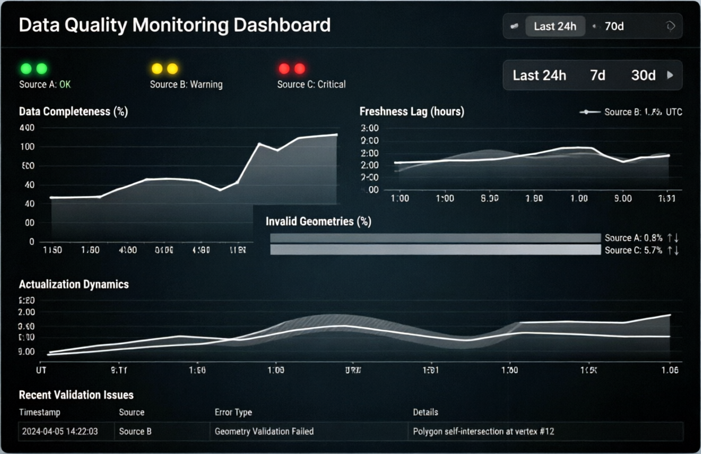
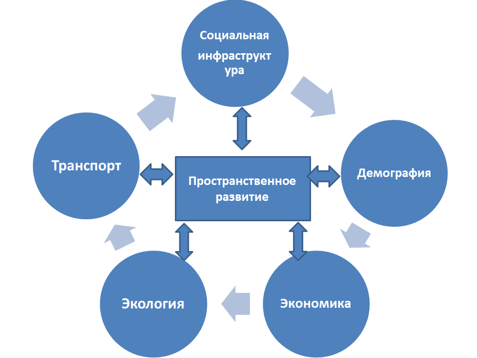
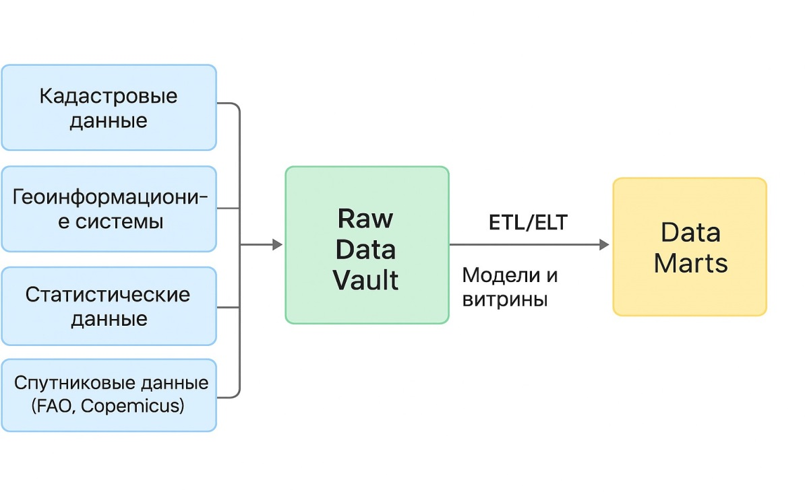
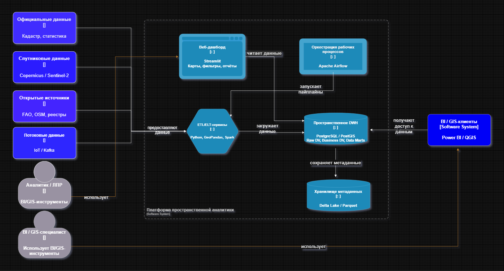
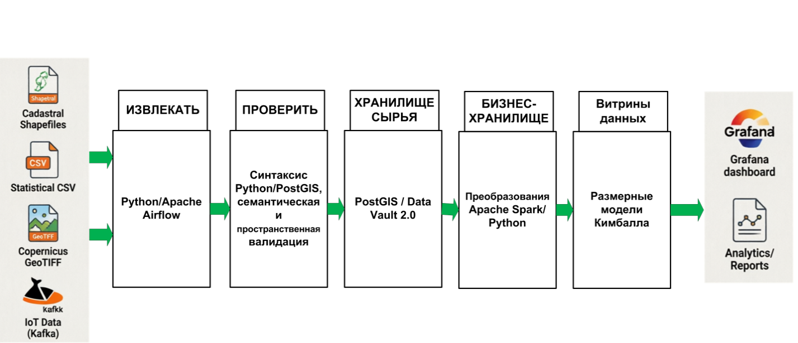
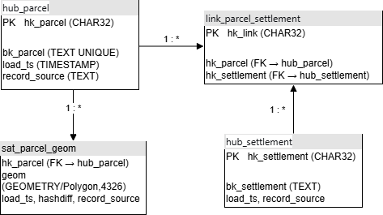
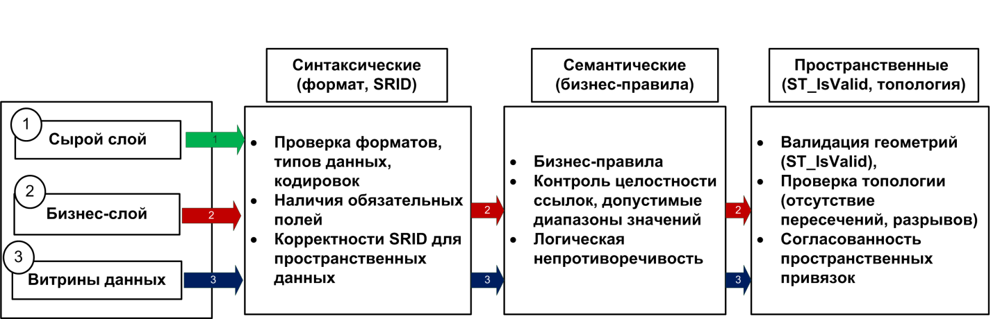

<style>
:root {
  --bg: #083542;
  --accent: #246569;
  --accent-2: #2f8fa2;
  --muted: #d7e7e9;
  --line: rgba(255,255,255,.32);
  --paper: #ffffff;
  --ink: #083542;
}

section {
  font-family: "Open Sans", Arial, sans-serif;
  background: #ffffff;
  color: var(--ink);
  padding: 58px 72px 56px 84px;
  letter-spacing: 0;
}

section.cover,
section.thanks {
  background: linear-gradient(90deg, #040606 0%, #083542 26%, #2e505b 58%, #228f78 83%, #22b8b2 100%);
  color: white;
}

section::before {
  content: none;
}

section::after {
  color: var(--accent);
  font-size: 22px;
  font-weight: 300;
  right: 48px;
  bottom: 34px;
}

section.cover::after,
section.thanks::after {
  color: rgba(255,255,255,.82);
}

h1 {
  color: var(--ink);
  font-size: 44px;
  line-height: 1.08;
  font-weight: 300;
  margin: 0 0 26px;
  max-width: 920px;
}

h2 {
  color: var(--accent);
  font-size: 18px;
  font-weight: 300;
  margin: -12px 0 34px;
}

h3 {
  color: var(--ink);
  font-size: 23px;
  line-height: 1.18;
  font-weight: 700;
  margin: 0 0 10px;
}

p, li {
  font-size: 24px;
  line-height: 1.34;
  font-weight: 300;
}

ul {
  margin: 0;
  padding-left: 28px;
}

li { margin: 8px 0; }

strong { font-weight: 700; }

.cover {
  display: grid;
  grid-template-columns: 1fr 380px;
  gap: 56px;
  align-items: end;
}

.cover h1 {
  color: rgba(255,255,255,.92);
  font-size: 47px;
  line-height: 1.1;
  margin-bottom: 36px;
}

.cover .meta {
  color: var(--muted);
  font-size: 20px;
  line-height: 1.5;
}

.cover .year {
  font-size: 34px;
  font-weight: 300;
  text-align: right;
  align-self: end;
}

.kicker {
  color: var(--accent);
  font-size: 20px;
  font-weight: 300;
  margin-bottom: 16px;
}

.chapter {
  position: absolute;
  left: 84px;
  bottom: 36px;
  font-size: 18px;
  color: var(--accent);
  max-width: 780px;
}

.split {
  display: grid;
  grid-template-columns: 1fr 1fr;
  gap: 54px;
  align-items: start;
}

.wide-split {
  display: grid;
  grid-template-columns: 42% 58%;
  gap: 36px;
  align-items: center;
}

.lead {
  font-size: 29px;
  line-height: 1.28;
  color: var(--ink);
}

.small li, .small p { font-size: 21px; }
.tight li { margin: 4px 0; }

.tag {
  display: inline-block;
  border: 1px solid rgba(36,101,105,.32);
  color: var(--accent);
  padding: 8px 13px;
  font-size: 17px;
  margin: 0 8px 10px 0;
}

.number-grid {
  display: grid;
  grid-template-columns: repeat(4, 1fr);
  gap: 26px;
  margin-top: 34px;
}

.metric {
  border-top: 2px solid var(--accent-2);
  padding-top: 16px;
}

.metric b {
  display: block;
  font-size: 42px;
  font-weight: 300;
  line-height: 1;
}

.metric span {
  display: block;
  color: var(--accent);
  font-size: 18px;
  line-height: 1.25;
  margin-top: 10px;
}

.table {
  display: grid;
  border-top: 2px solid var(--accent-2);
  margin-top: 18px;
}

.row {
  display: grid;
  grid-template-columns: 34% 22% 22% 22%;
  border-bottom: 1px solid rgba(36,101,105,.18);
}

.row > div {
  padding: 11px 12px;
  font-size: 18px;
  line-height: 1.22;
}

.row.head > div {
  color: var(--accent);
  font-weight: 700;
}

.img-wrap {
  background: white;
  padding: 14px;
  box-shadow: 0 12px 34px rgba(0,0,0,.22);
}

.img-wrap img {
  display: block;
  width: 100%;
  max-height: 470px;
  object-fit: contain;
}

.dark-img {
  padding: 0;
  background: transparent;
  box-shadow: none;
}

.dark-img img { max-height: 535px; }

.pipeline-img img { max-height: 330px; }

.diagram {
  border: 1px solid rgba(36,101,105,.28);
  background: #f5fafb;
  padding: 22px;
  box-shadow: 0 10px 28px rgba(8,53,66,.12);
}

.diagram-title {
  color: var(--accent);
  font-size: 20px;
  font-weight: 700;
  margin-bottom: 16px;
}

.diagram-flow {
  display: grid;
  gap: 10px;
}

.diagram .box {
  border-left: 4px solid var(--accent-2);
  background: white;
  padding: 12px 14px;
  font-size: 19px;
  line-height: 1.2;
}

.diagram-flow .arrow {
  color: var(--accent);
  text-align: center;
  font-size: 22px;
}

.mini-grid {
  display: grid;
  grid-template-columns: 1fr 1fr;
  gap: 12px;
}

.mini-grid .box {
  min-height: 64px;
}

.steps {
  display: grid;
  grid-template-columns: repeat(5, 1fr);
  gap: 14px;
  margin-top: 28px;
}

.step {
  border-top: 2px solid var(--accent-2);
  padding-top: 14px;
}

.step b {
  display: block;
  font-size: 18px;
  color: var(--accent);
  margin-bottom: 12px;
}

.step span {
  display: block;
  font-size: 20px;
  line-height: 1.22;
}

.quote {
  font-size: 32px;
  line-height: 1.3;
  font-weight: 300;
  max-width: 1000px;
}

.thanks {
  display: grid;
  height: 100%;
  align-content: center;
}

.thanks h1 {
  color: rgba(255,255,255,.92);
  font-size: 56px;
  font-weight: 300;
}
</style>

<!-- _class: cover -->
<div class="cover">
<div>

# Разработка хранилища данных информационной системы пространственного развития территории

<div class="meta">
Баарини Мохаб, DevOps24-1M<br>
Выпускная квалификационная работа<br>
Направление подготовки 09.04.03 «Прикладная информатика»<br>
Программа магистратуры «DevOps-инженерия»<br>
Руководитель ВКР: доцент, к.т.н. Е.С. Будаев
</div>

</div>
<div class="year">2026</div>
</div>

---

# Актуальность темы исследования
## Введение

<div class="split">
<div>

<p class="lead">Пространственное развитие территории требует не разрозненных файлов и отчётов, а единой аналитической среды для управленческих решений.</p>

</div>
<div class="small">

- кадастровые, статистические, геоинформационные и спутниковые данные хранятся в разных форматах;
- существующие решения часто не обеспечивают историзацию и контроль качества;
- для мухафазы Тартус критичны динамика урбанизации, транспортная доступность, экология и демография;
- хранилище данных становится интеграционным слоем между источниками, ГИС и BI-аналитикой.

</div>
</div>

<div class="chapter">Введение</div>

---

# Цели и задачи исследования
## Введение

<p class="lead"><strong>Цель:</strong> разработать и апробировать хранилище данных, обеспечивающее интеграцию, хранение и аналитическую обработку данных пространственного развития территории на примере мухафазы Тартус.</p>

<div class="split small">
<div>

- проанализировать подходы к пространственному развитию и систему показателей региона;
- сравнить Inmon, Kimball, Data Vault и Anchor Modeling;
- обосновать гибридный подход для пространственных данных;

</div>
<div>

- разработать архитектуру Data Vault 2.0 + Data Marts;
- реализовать ETL/ELT для GeoJSON и CSV в исполняемом прототипе;
- апробировать прототип и встроить базовые DevOps-практики.

</div>
</div>

<div class="chapter">Введение</div>

---

# Научная новизна магистерского исследования
## Введение

<div class="split small">
<div>

- предложена гибридная архитектура хранилища пространственного развития: Data Vault как слой интеграции и историзации, Data Marts как аналитический слой;
- система показателей увязана с источниками, периодичностью обновления и способом загрузки;
- разработан механизм оценки достоверности данных по источнику, актуальности и пространственной согласованности;

</div>
<div>

- метаданные пространственных объектов включают систему координат, источник, временную метку и уровень достоверности;
- контроль качества реализован как код и встроен в ETL/ELT-пайплайн;
- прототип подтверждает загрузку, хранение и аналитическую обработку геоданных.

</div>
</div>

<div class="chapter">Введение</div>

---

# Апробация результатов магистерского исследования
## Введение

<div class="wide-split">
<div class="small">

- прототип реализован на данных мухафазы Тартус;
- использованы GeoJSON-слои землепользования, дорожной сети и границ районов, а также статистические CSV;
- выполнены SQL-запросы к витринам, пространственные операции PostGIS и визуализация в Streamlit / Folium;
- исходные артефакты представлены в текущем проекте: `db/init`, `etl`, `dags`, `sql`, `sample_data`.

</div>
<div class="img-wrap dark-img">
  
</div>
</div>

<div class="chapter">Введение</div>

---

# Предметная область исследования
## Глава 1. Теоретические аспекты. Предметная область исследования

<div class="wide-split">
<div class="small">

Пространственное развитие рассматривается как баланс пяти групп факторов:

- транспорт;
- социальная инфраструктура;
- демография;
- экология;
- экономика.

Для регионального управления ценность возникает при совместном анализе этих факторов во времени и на карте.

</div>
<div class="img-wrap">
  
</div>
</div>

---

# Конкурентная среда разработки
## Глава 1. Теоретические аспекты. Предметная область исследования

<div class="split small">
<div>

Исследование сравнивает четыре подхода к построению хранилищ:

<span class="tag">Inmon</span>
<span class="tag">Kimball</span>
<span class="tag">Data Vault</span>
<span class="tag">Anchor Modeling</span>

</div>
<div>

Вывод сравнительного анализа: для пространственных данных нужен не один классический подход, а комбинация.

- Data Vault 2.0 отвечает за гибкость, историзацию и интеграцию источников;
- Kimball Data Marts дают удобный слой для BI, OLAP и ГИС-аналитики;
- Lambda-элементы позволяют учитывать пакетные и потоковые источники.

</div>
</div>

---

# Рассматриваемые проблемы и методы их решения
## Глава 2. Сравнительный анализ методов разработки. Моделирование и проектирование

<div class="split small">
<div>

Проблемы:

- разнородные форматы данных и ведомственные источники;
- отсутствие единой историзованной модели;
- ошибки геометрий, кодировок и классификаторов;
- слабая связь между хранилищем, ГИС и BI.

</div>
<div>

Методы решения:

- Raw Data Vault и Business Data Vault;
- PostGIS для пространственных типов и операций;
- открытые форматы GeoJSON и CSV для демонстрационного набора данных;
- Data Quality as Code в ETL/ELT;
- Docker Compose, оркестрация Airflow и наблюдаемость.

</div>
</div>

---

# Архитектурные решения и технологический стек
## Глава 2. Сравнительный анализ методов разработки. Моделирование и проектирование

<div class="wide-split">
<div class="small">

Технологический стек прототипа:

- PostgreSQL / PostGIS;
- Python ETL/ELT;
- Apache Airflow;
- Streamlit и Folium;
- Docker Compose;
- Prometheus, postgres-exporter и cAdvisor.

</div>
<div class="img-wrap dark-img">
  
</div>
</div>

---

# Гибридное хранилище в архитектурной нотации
## Глава 2. Сравнительный анализ методов разработки. Моделирование и проектирование

<div class="wide-split">
<div class="small">

Архитектура связывает источники, хранилище и аналитические потребители:

- GeoJSON-источники: границы районов, землепользование и дорожная сеть;
- CSV-источники: демография, занятость, доходы и экологические показатели;
- ETL/ELT-сервисы на Python и SQL;
- пространственное DWH на PostgreSQL/PostGIS;
- Streamlit/Folium-дэшборд и мониторинг Prometheus.

</div>
<div class="img-wrap dark-img">
  
</div>
</div>

---

# Разработка информационной системы
## Глава 3. Разработка архитектурного решения, алгоритмов, кода программ. Тестирование и внедрение

<div class="wide-split">
<div class="small">

Реализованный прототип включает:

- слой источников: GeoJSON и CSV из `sample_data`;
- слой `raw`: первичная загрузка участков, дорог, районов и статистики;
- слой `dv`: хабы, связи и сателлиты Data Vault;
- слой `dm`: витрины для аналитики и дэшборда.

</div>
<div class="img-wrap">
  
</div>
</div>

---

# Этапы разработки информационной системы
## Глава 3. Разработка архитектурного решения, алгоритмов, кода программ. Тестирование и внедрение

<div class="steps">
<div class="step"><b>1. Extract</b><span>GeoJSON и CSV из sample_data</span></div>
<div class="step"><b>2. Validate</b><span>типы геометрий, обязательные поля, числовые диапазоны</span></div>
<div class="step"><b>3. Raw Layer</b><span>parcel_raw, roads_raw, settlement_raw, statistics_raw</span></div>
<div class="step"><b>4. Data Vault</b><span>хабы, связи, сателлиты, ST_Intersects</span></div>
<div class="step"><b>5. Data Marts</b><span>витрины для Streamlit и анализа</span></div>
</div>

<div class="img-wrap pipeline-img" style="margin-top: 18px;">
  
</div>

---

# Разработка программного кода информационной системы
## Глава 3. Разработка архитектурного решения, алгоритмов, кода программ. Тестирование и внедрение

<div class="split small">
<div>

Кодовая база прототипа включает:

- SQL-скрипты для схем `raw`, `dv` и `dm`;
- Python ETL/ELT-скрипты;
- Airflow DAG для оркестрации;
- проверки качества данных;
- Docker Compose, Prometheus и конфигурации окружения.

</div>
<div>

Фрагмент структуры репозитория:

```text
docker-compose.yml
db/init/
sql/
etl/
dags/
sample_data/
prometheus.yml
verify_data.py
```

</div>
</div>

---

# Разработка программного кода информационной системы
## Глава 3. Разработка архитектурного решения, алгоритмов, кода программ. Тестирование и внедрение

<div class="wide-split">
<div class="small">

Ключевая часть модели Data Vault:

- `hub_parcel` хранит уникальные бизнес-ключи земельных участков;
- `hub_settlement` хранит населённые пункты;
- `link_parcel_settlement` связывает участки и поселения;
- `sat_parcel_geom` хранит геометрию в PostGIS.

</div>
<div class="img-wrap">
  
</div>
</div>

---

# Тестирование информационной системы
## Глава 3. Разработка архитектурного решения, алгоритмов, кода программ. Тестирование и внедрение

<div class="wide-split">
<div class="small">

Контроль качества выполняется на трёх уровнях:

- синтаксический: формат, типы данных, кодировки, SRID;
- семантический: бизнес-правила, целостность ссылок, диапазоны значений;
- пространственный: валидность геометрий, топология, согласованность привязок.

Проверки интегрируются в ETL/ELT и выполняются отдельной задачей Airflow.

</div>
<div class="img-wrap">
  
</div>
</div>

---

# Визуализация работы информационной системы
## Глава 3. Разработка архитектурного решения, алгоритмов, кода программ. Тестирование и внедрение

<div class="number-grid">
<div class="metric"><b>2013–2023</b><span>период анализа землепользования и демографии</span></div>
<div class="metric"><b>–8%</b><span>сельскохозяйственные угодья</span></div>
<div class="metric"><b>+12%</b><span>застроенные территории</span></div>
<div class="metric"><b>780×2</b><span>полигонов землепользования за 2013 и 2023 годы</span></div>
</div>

<div class="number-grid">
<div class="metric"><b>+6%</b><span>PM2.5 за пять лет</span></div>
<div class="metric"><b>12 219</b><span>сегментов дорожной сети</span></div>
<div class="metric"><b>+4,55%</b><span>численность населения</span></div>
<div class="metric"><b>–4 п.п.</b><span>средний уровень занятости</span></div>
</div>

---

# Оценка использования современных технологических практик DevOps
## Глава 3. Разработка архитектурного решения, алгоритмов, кода программ. Тестирование и внедрение

<div class="split small">
<div>

DevOps-практики применены для воспроизводимости и эксплуатации:

- воспроизводимое окружение: Docker Compose;
- оркестрация: Apache Airflow DAG `tartus_spatial_etl`;
- Data Quality as Code: Python-проверки валидности, полноты и диапазонов;
- наблюдаемость: Prometheus, postgres-exporter и cAdvisor.

</div>
<div>

Контур безопасности и эксплуатации:

- параметры подключения вынесены в `.env` и `.env.example`;
- сервисы изолированы в Docker Compose;
- проверка заполнения слоёв выполняется через `verify_data.py`;
- RBAC, аудит и централизованное хранилище секретов выделены как этап промышленного развития.

</div>
</div>

---

# Прикладное, внедренческое значение ВКР
## Заключение

<div class="split small">
<div>

Разработанный прототип применим для поддержки решений органов управления Тартуса:

- объединяет разрозненные источники в единую аналитическую среду;
- показывает динамику землепользования, транспорта, экологии и демографии;
- позволяет формировать тематические отчёты и дашборды;
- может тиражироваться в других регионах Сирии.

</div>
<div>

Практические рекомендации:

- перейти от экстенсивного расширения городов к внутреннему уплотнению;
- модернизировать дороги в периферийных районах;
- усилить мониторинг PM2.5, NO2, NDVI и качества воды;
- развивать агропромышленные кластеры и удалённые услуги.

</div>
</div>

---

# Основные выводы
## Заключение

<div class="table">
<div class="row head"><div>Направление</div><div>Результат</div><div>Технологии</div><div>Эффект</div></div>
<div class="row"><div>Методология</div><div>Data Vault + Kimball</div><div>DV 2.0, Data Marts</div><div>историзация и аналитика</div></div>
<div class="row"><div>Геоданные</div><div>модель доменов</div><div>PostGIS, GeoJSON</div><div>пространственный анализ</div></div>
<div class="row"><div>Загрузка</div><div>ETL/ELT-пайплайны</div><div>Python, SQL, Airflow</div><div>воспроизводимость</div></div>
<div class="row"><div>Качество</div><div>проверки как код</div><div>Python DQ, verify_data</div><div>доверие к данным</div></div>
<div class="row"><div>Апробация</div><div>анализ Тартуса</div><div>PostGIS, Streamlit</div><div>рекомендации развития</div></div>
</div>

<p class="quote" style="margin-top: 28px;">Поставленная цель достигнута: разработана архитектура и реализован прототип хранилища данных для информационной системы пространственного развития территории.</p>

---

<!-- _class: thanks -->
<div class="thanks">

# Спасибо за внимание!

<p>Баарини Мохаб<br>
DevOps24-1M</p>

</div>
